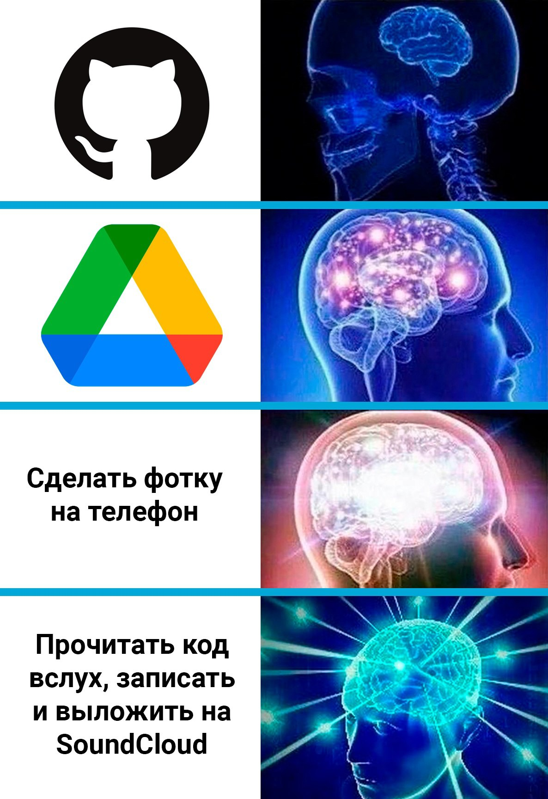

## My portfolio

### **Hello and welcome to this page!** 

Here i'll talk a little about my career and some of my personal life

### _About myself_

Well first of all, let me introduce myself - my name is Olga and i am 26 y.o. I studied languages at univercity in Moscow and i did'n want to stop there so now i'm studying to become QA-engineer with the help of brilliant teachers at [Netology.ru](https://netology.ru/)

So far it's been a lovely experience but there's not much i can share with you just yet, so here's some QA meme for you:

